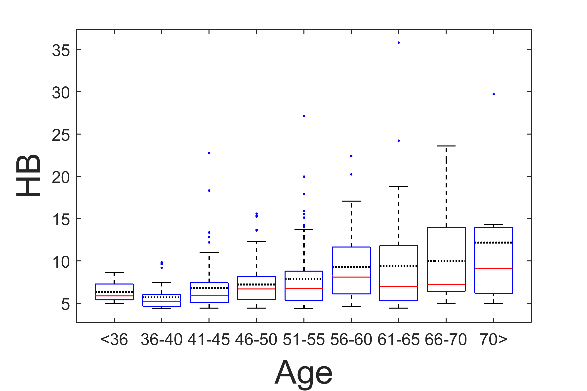
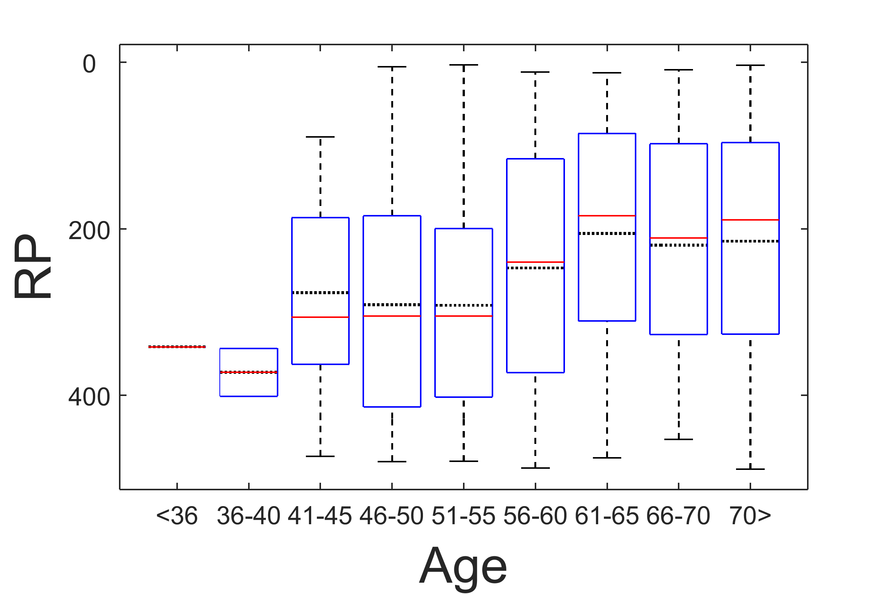

[](http://quantlet.de/index.php?p=info)

## [](http://quantlet.de/) **ARRboxage** [](http://quantlet.de/d3/ia)


```yaml

Name of QuantLet : ARRboxage

Published in : ARR - Academic Rankings Research

Description: 'Creates boxplots of the main scores of Handelsblatt (HB), RePEc (RP) 
and Google Scholar (GS) rankings over the age intervalls: <35, 36-40, 41-45, 
46-50, 51-55, 56-60, 61-65, 66-70, 71>'

Keywords : 'plot, dependence, multivariate, multivariate analysis, visualization, 
data visualization, analysis, discriptive methods, discriptive, graphical representation, 
boxplot, descriptive-statistics, five number summary'

See also : 'ARRcormer, ARRhexage, ARRhexcit, ARRhexhin, ARRhismer, ARRmosage, ARRmoagegr, ARRreghb, 
ARRboxgscit, ARRpcpgscit, ARRboxhb, ARRpcphb, ARRpcpmer, ARRscamer'

Author : Alona Zharova

Submitted : Tue, December 15 2015 by Alona Zharova, Marius Sterling

Datafile : 'ARRdatage.csv - The data set contains the top ranked researchers 
and there estimated age of HB, GS, RP'

Example : Boxplot
```






```r


%% Clearing all variables
clear all; clc;
%% Image settings
fonttype      = 'Helvetica';
fontsize      = 24;
fontsize_axes = 12;
papersize     = [15 10];
%% Data input
subage   = readtable('ARRdatage.csv','Delimiter',';');
%% Data selection
subagehb = table2array(subage(:, 1:2));
subagerp = table2array(subage(:, 3:4));
subagegs = table2array(subage(:, 5:6));
%% Data 
ages     = [0 35 40 45 50 55 60 65 70 999];
label    = {'<35' '36-40' '41-45' '46-50' '51-55' '56-60' '61-65' '66-70' '71>'};
%% Function for boxplot
% function ARRboxage_fun(data,papersize,label,fontsize,fontsize_axes,fonttype,filename,x_label,y_label,ages)
% % creating a figure
% figure1 = figure('Visible','off','PaperPosition',[0 0 papersize],'PaperSize',papersize);
%     % empty vectors for the age categories
%     age_vector= repmat(0,size(data,1),1);
%     ages_TF=repmat(0,size(ages,2),1);
%     % filling the vectors defined before
%     for i=1:(length(ages)-1)
%         tmp=(data(:,1)>ages(i)).*(data(:,1)<=ages(i+1));
%         tmp_age(:,i)=logical(tmp);
%         age_vector=age_vector+tmp_age(:,i)*i;
%         m(i)=mean(data(tmp_age(:,i),2));
%         ages_TF(i)=sum(age_vector==i)>0;
%     end
%     hold on
%     % drawing the means for the agegroups
%     for l_i=1:(length(ages)-1)
%         a=0.6+l_i-1-sum(isnan(m(1:l_i)));
%         b=1.4+l_i-1-sum(isnan(m(1:l_i)));
%         if ~isnan(m(l_i))
%             line([a b],[m(l_i) m(l_i)],'Color','k','LineStyle',':','LineWidth',1.2);
%         end
%     end
%     % boxplots
%     boxplot(data(:,2),age_vector,'Symbol','.','labels',label(logical(ages_TF)),'widths',0.8)
%     % axis labels
%     set(gca,'FontSize',fontsize_axes,'FontName',fonttype);
%     xlabel(x_label,'FontSize',fontsize,'FontName',fonttype);
%     ylabel(y_label,'FontSize',fontsize,'FontName',fonttype);
%     hold off
%     set(figure1,'Position',[0 0 1 1]);
% % creating the figure as a png with the name of variable filename
% print(figure1,'-dpng','-r400',filename);
% end
%% Creating figures with function
ARRboxage_fun(subagehb,papersize,label,fontsize,fontsize_axes,fonttype,'ARRboxage_HB','Age','HB',ages)
ARRboxage_fun(subagerp,papersize,label,fontsize,fontsize_axes,fonttype,'ARRboxage_RP','Age','RP',ages)
ARRboxage_fun(subagegs,papersize,label,fontsize,fontsize_axes,fonttype,'ARRboxage_GS','Age','GS',ages)
        
```
