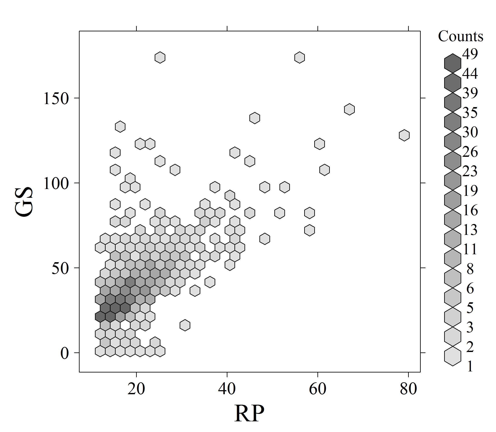
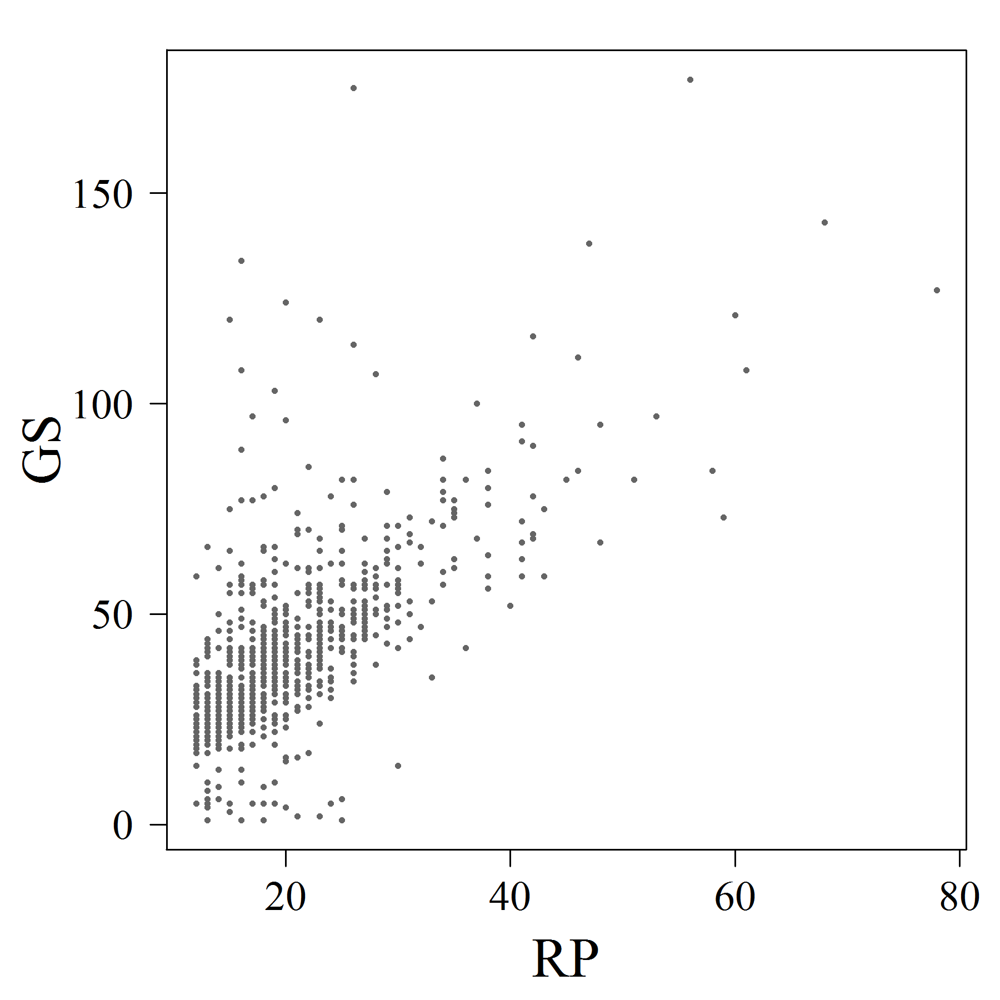

[](http://quantlet.de/)

## [](http://quantlet.de/) **ARRhexhin** [](http://quantlet.de/)

```yaml

Name of QuantLet : ARRhexhin

Published in : ARR - Academic Rankings Research

Description : 'Produces scatter and hexagon plots between the h-index score listed in RePEc (RP)
and Google Scholar (GS) rankings'

Keywords : 'plot, hexagon-plot, scatterplot, analysis, multivariate analysis, multivariate,
visualization, data visualization, counts, dependence, descriptive methods, correlation,
correlation-matrix, descriptive, graphical representation'

See also : 'ARRboxage, ARRboxgscit, ARRboxhb, ARRcormer, ARRdenmer2d, ARRdenmer3d, ARRhexage,
ARRhexcit, ARRhismer, ARRmosage, ARRmosagegr, ARRmossub, ARRpcpgscit, ARRpcphb, ARRpcpmer,
ARRpcprp, ARRqrqqhb, ARRscaage, ARRscamer'

Author : Alona Zharova

Submitted : Sat, April 30 2016 by Alona Zharova, Marius Sterling

Datafile : 'ARRdata.csv - The data set contains different researcher (3218 rows) of either RePEc
(77 columns), Handelsblatt (48 columns) ranking or both and their Google Scholar data (16 columns)
as well as age and subject fields (2 columns)'

Output : 'Scatterplot (left) and hexagon plot (right) of RP and GS h-index for 928 researchers
equals to 2015. Correlation coefficient equals to 0.68'

```






### R Code:
```r

# clear history
graphics.off()
rm(list = ls(all = TRUE))

#loading library
libraries = c("hexbin")
lapply(libraries,function(x)if(!(x %in% installed.packages())){install.packages(x)})
lapply(libraries,library,quietly=TRUE,character.only=TRUE)

# setting (font, color) for output
color                = 100     # color of plot symbols and hexagons, value between 1 (black) and 254 (white)
font                 = "serif" # Font Times
res                  = 300

#scatterplot
cex                  = 0.5     # size of plot symbol
pch                  = 16      # plot symbol, 16= filled circle
cex_lab              = 2       # size of label symbols
cex_axis             = 1.5     # size of axes label symbols
cex_main             = 2       # size of main label symbols

#hexbinplot
label.size.main_axis = 2.35    # size of label symbols
label.size.support   = 1.5     # size of axes label symbols
col.from             = 0.2    # shading from this percentage on (number between 0 and 1)

# data input and selection of h-index of RePEc and GS
data  = read.csv2("ARRdata.csv",sep=";",dec=",",header = T,stringsAsFactors = FALSE)
data  = data[!is.na(data$rp_author)&!is.na(data$gs_author),]
data2 = data[!is.na(data$rp_h.index_score),]

# scatterplot GS and RP h.index
png(file = "ARRhexhinscat.png", widt = 6, height = 6, units = "in", res = res, family = font)
  par(cex.lab = cex_lab, cex.axis = cex_axis, cex.main = cex_main, las = 1, pty = "s", 
      mar = c(4, 5, 1, 1))
  plot(data$rp_h.index_score, data$gs_h_index, xlab = "RP", ylab = "GS", pch = pch, 
       axes = F, col = rgb(color, color, color, alpha = 254, maxColorValue = 255), cex = cex)
  ax = (0:4) * 20
  axis(1, at = ax, labels = ax, cex.axis = cex_axis)
  ax = (0:4) * 50
  axis(2, at = ax, labels = ax, cex.axis = cex_axis)
  box()
dev.off()

png(file = "ARRhexhinbin.png", width = 7.75, height = 6.75, units = "in", res = res, 
    family = font)
  hexbinplot(data2$gs_h_index ~ data2$rp_h.index_score, xlab = list(label = "RP", cex = label.size.main_axis), 
             ylab = list(label = "GS", cex = label.size.main_axis), style = "colorscale", 
             border = TRUE, aspect = 1, trans = sqrt, inv = function(ages) ages^2,
             scales = list(cex = label.size.support + 0.15), cex.labels = label.size.support, 
             cex.title = label.size.support, colramp = function(n) {
               rgb(1, 1, 1, alpha = seq(from = col.from, to = 0.999, length = n) * (255 - color), 
                   maxColorValue = 255)
               })
  # style=colorscale: string specifying the style of hexagon plot, see
  # 'grid.hexagons' for the possibilities!  border=TRUE: frame around the hexagons!
  # coloramp: color of hexagon depends on count it represents as greater counts as
  # darker!
dev.off() 

```
