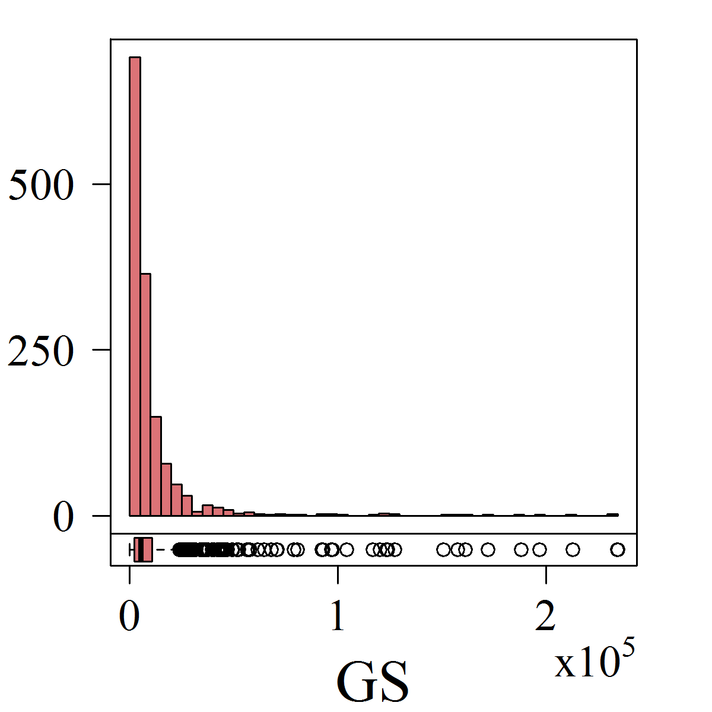
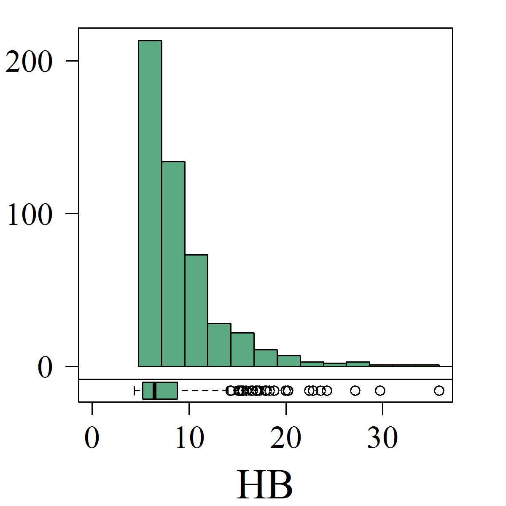

[](http://quantlet.de/index.php?p=info)

## [](http://quantlet.de/) **ARRhismer** [](http://quantlet.de/d3/ia)

```yaml

Name of QuantLet : ARRhismer

Published in : ARR - Academic Rankings Research

Description : 'Plots histograms of Handelsblatt (HB) common score, RePEc (RP) average score and
Google Scholar (GS) citations'

Keywords : 'plot, scatterplot, analysis, multivariate analysis, multivariate, visualization, data
visualization, counts, dependence, discriptive methods, histogram, distribution, density, graphical
representation, estimation, smoothing, descriptive'

See also : 'ARRboxage, ARRboxgscit, ARRboxhb, ARRcormer, ARRdenmer2d, ARRdenmer3d, ARRhexage,
ARRhexcit, ARRhexhin, ARRmosage, ARRmosagegr, ARRmossub, ARRpcpgscit, ARRpcphb, ARRpcpmer,
ARRpcprp, ARRqrqqhb, ARRscaage, ARRscamer'

Author : Alona Zharova

Submitted : Sat, April 30 2016 by Alona Zharova, Marius Sterling

Datafile : 'ARRdata.csv - The data set contains different researcher (3218 rows) of either RePEc
(77 columns), Handelsblatt (48 columns) ranking or both and their Google Scholar data (16 columns)
as well as age and subject fields (2 columns)'

Output : 'Histogram of HB (500 observations, Common Score), RP (2304, total score ×103) and GS
(1357, citations ×105) rankings for December 2015'

```






### R Code:
```r
# close windows and clear variables
graphics.off()
rm(list=ls(all=TRUE))

# library(sfsmisc)
# picture settings
font       = "serif" # font Times
cex.lab    = 2
cex.axis   = 1.5
res        = 300

# color settings
max        = 180
az_red     = rgb(138, 15, 20,alpha=0.6  *max,maxColorValue = max)
az_green   = rgb(  0, 87, 44,alpha=0.65 *max,maxColorValue = max)
az_blue    = rgb(  0, 55,108,alpha=0.8  *max,maxColorValue = max)

# input data
data       = read.csv2("ARRdata.csv",sep=";",dec=",",header = T,stringsAsFactors = FALSE)
log_age    = !is.na(data$age_combined)
log_subfil = !is.na(data$subject_fields)
log_only   = TRUE #log_age#&log_subfil

# function for the breaks used in the histogram plot
breaks = function(x,x0,h){
  b = floor((min(x)-x0)/h) : ceiling((max(x)-x0)/h)
  b = b*h+x0
  return(b)
}

#Plot histograms
png(file = "ARRhismer_hb.png", width = 4, height = 4, units = "in", res = res, family = font)
  par(mar = c(0, 3.1, 1.1, 2.1), cex.lab = cex.lab, cex.axis = cex.axis, las = 1)
  # las=1: style of axis labels, here always horizontal!
  nf = layout(mat = matrix(c(1, 2), 2, 1, byrow = TRUE), height = c(3, 1))
  # HB histogram
  x = unlist(data$hb_commonscore[(!is.na(data$hb_commonscore)) & log_only])
  tmp1 = hist(x, freq = T, main = NA, breaks = breaks(x, x0 = 0, 2), xlim = c(0, 30), 
              xlab = NA, ylab = NA, axes = F, col = az_green)
  ax = c(0:2) * 100
  axis(2, at = ax, labels = ax, cex.axis = cex.axis)
  box(lwd = 1)
  par(mar = c(4.1, 3.1, 0, 2.1))
  boxplot(x, horizontal = TRUE, outline = TRUE, ylim = c(0, max(x)), frame = T, axes = F, 
          names = "HB", sub = "HB", col = az_green, width = 0.25)
  ax = c(0:3) * 10
  axis(1, at = ax, labels = ax, cex.axis = cex.axis)
  title(xlab = "HB")
dev.off()

png(file = "ARRhismer_rp.png", width = 4, height = 4, units = "in", res = res, family = font)
  par(mar = c(0, 3.1, 1.1, 2.1), cex.lab = cex.lab, cex.axis = cex.axis, las = 1)
  rp_average_rank_score = as.numeric(data$rp_average_rank_score[(!is.na(data$rp_author)) &log_only])
  nf = layout(mat = matrix(c(1, 2), 2, 1, byrow = TRUE), height = c(3, 1))
  tmp2 = hist(rp_average_rank_score/10^3, freq = T, breaks = breaks(rp_average_rank_score/10^3,x0 = 0, 0.1), 
              main = NA, xlab = NA, ylab = NA, axes = F, col = az_blue)
  ax = c(0:2) * 50
  axis(2, at = ax, labels = ax, cex.axis = cex.axis)
  box(lwd = 1)
  par(mar = c(4.1, 3.1, 0, 2.1))
  boxplot(rp_average_rank_score/10^3, horizontal = TRUE, outline = TRUE, width = 2,
          ylim = c(0, max(rp_average_rank_score/10^3)), frame = T, axes = F, names = "GS", col = az_blue)
  ax = c(0:2)
  axis(1, at = ax, labels = ax, cex.axis = cex.axis)
  title(xlab = "RP")
  mtext(expression(displaystyle(x) * 10^3), side = 1, adj = 1, padj = 2, outer = FALSE, cex = cex.axis)
dev.off()

# GS histogram
png(file = "ARRhismer_gs.png", width = 4, height = 4, units = "in", res = res, family = font)
  par(mar = c(0, 3.1, 1.1, 2.1), cex.lab = cex.lab, cex.axis = cex.axis, las = 1)
  nf = layout(mat = matrix(c(1, 2), 2, 1, byrow = TRUE), height = c(3, 1))
  gs_cit = data$gs_total_cites[(!is.na(data$gs_total_cites)) & log_only]
  tmp3 = hist(gs_cit/10^5, freq = T, main = NA, xlab = "GS", ylab = NA, 
              breaks = breaks(gs_cit/10^5, x0 = 0, 0.05), axes = F, col = az_red)
  ax = c(0:3) * 250
  axis(2, at = ax, labels = ax, cex.axis = cex.axis)
  box(lwd = 1)
  par(mar = c(4.1, 3.1, 0, 2.1))
  boxplot(gs_cit/10^5, horizontal = TRUE, outline = TRUE, ylim = c(0, max(gs_cit/10^5)), 
          frame = T, axes = F, names = "GS", col = az_red, width = 2)
  ax = c(0:2)
  axis(1, at = ax, labels = ax, cex.axis = cex.axis)
  title(xlab = "GS")
  mtext(expression(displaystyle(x) * 10^5), side = 1, adj = 1, padj = 2, outer = FALSE, cex = cex.axis)
dev.off() 

```
