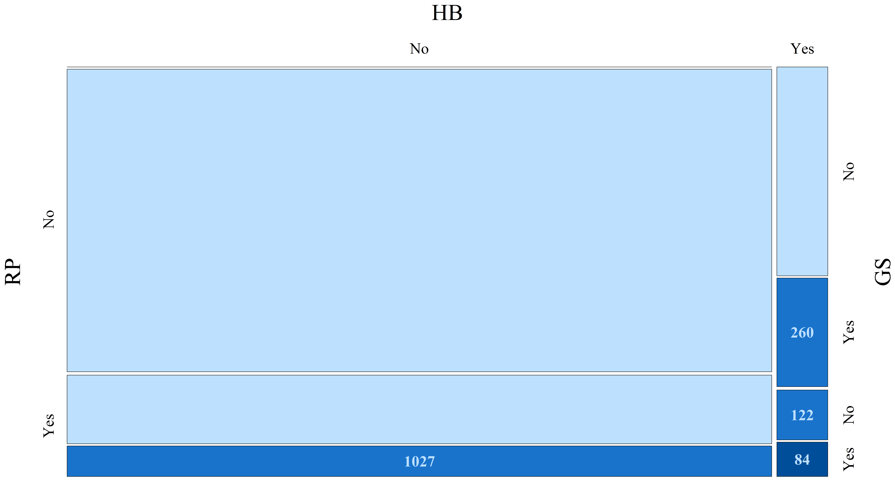

[](http://quantlet.de/index.php?p=info)

## [](http://quantlet.de/) **ARRmosage** [](http://quantlet.de/d3/ia)


```yaml

Name of QuantLet : ARRmosage

Published in: ARR - Academic Rankings Research

Description : 'Produces the mosaic plot of number of 
researchers, when merging of Handelsblatt (HB), 
RePEc (RP) and Google Scholar (GS) rankings takes place'   

Keywords : 'mosaic plot, multivariate, data visualization, analysis, discriptive methods'

See also : 'ARRboxage, ARRboxgscit, ARRboxhb, ARRcormer, ARRdenmer2d, ARRdenmer3d, ARRhexage, ARRhexcit, 
ARRhexhin, ARRhismer, ARRmosagegr, ARRmossub, ARRpcpgscit, ARRpcphb, ARRpcpmer, 
ARRpcprp, ARRqrqqhb, ARRscaage, ARRscamer'

Author : Alona Zharova

Submitted : Sat, April 30 2016 by Alona Zharova, Marius Sterling

Datafile : 'ARRmosage.csv - The data set contains the number of researchers who  
are in one, two or all three rankings (HB, RP, GS)'

Output : 'Mosaic plot for the number of researchers, when merging of HB, RP and GS
rankings takes place or not (Yes/No). The number of GS profiles is quite large and is
here shown only figurative. Ranking data of researchers in 2015 (RP, GS and HB VWL
LW) and 2014 (HB BWL LW) have been used'

```




```r

# clear variables
rm(list=ls(all=TRUE))

# Install Packages
libraries = c("vcd")
lapply(libraries, function(x) if (!(x %in% installed.packages())) {
  install.packages(x)
})
lapply(libraries, library, quietly = TRUE, character.only = TRUE)

# setting (font, color) for output, depending on choice
font         = "Helvetica"
azure.colors = c("azure1","azure2","azure3","azure4")

# load data
m            = read.csv2("ARRmosage.csv", header = TRUE)
m            = m[order(m[,2],m[,3],m[,4],decreasing = F),]
colgr        = 1+(m$HB=="Yes")+(m$RP=="Yes")+(m$GS=="Yes")
m$color      = azure.colors[colgr]

# If you want to use this plot in a latex document than remove the hash-symbols infront of pdf(...) and dev.off()!
# pdf(...) creates a pdf file named "ARRmosage.pdf" of graphics between pdf(...) and dev.off() 
# pdf(file="ARRmosage.pdf",width=16, height=8,fonts = font)

# mosaic plot of age groups against Ranking groups
  mosaic(~HB + RP + GS, data=m, 
         gp                = gpar(fill = m$color),                                                  # coloring according to number of merged rankings
         shade             = TRUE,                                                                  # coloring according to gp
         direction         = c("v", "h", "h"),                                                      # setting the axis 
         labeling          = labeling_values,                                                       # writing the values in the boxes
         gp_text           = gpar(fontsize = 15,fontface = 2),                                          # setting of the cell labels
         labeling_args     = list(gp_labels = gpar(fontsize = 18, fontface = 1),
                                  gp_varnames = gpar(fontsize = 20, fontface = 1)),                  # settings for the axis labels (font, fontsize)
         keep_aspect_ratio = FALSE,                                                                 # allowing different length and width of plot, here fitted to pdf size
         margins           = unit(5, "lines")                                                       # spacing from margins
         )
# dev.off() 

```
