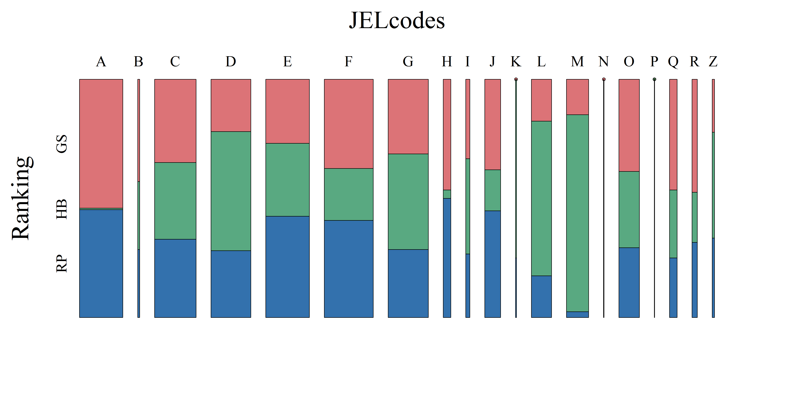

[](http://quantlet.de/index.php?p=info)

## [](http://quantlet.de/) **ARRmossub** [](http://quantlet.de/d3/ia)


```yaml

Name of QuantLet : ARRmossub

Published in : ARR - Academic Rankings Research

Description : 'Produces mosaic plot and histograms for the count of researchers  JEL codes 
(a subject field classification) over the different rankings Handelsblatt (HB), RePEc (RP) and 
Google Scholar (GS)'   

Keywords : 'plot, hexagon-plot, scatterplot, analysis, multivariate analysis, 
multivariate, visualization, data visualization, counts, dependence, discriptive methods,
histogram, distribution, density, graphical representation, estimation, smoothing, 
descriptive, descriptive methods'

See also : 'ARRboxage, ARRboxgscit, ARRboxhb, ARRcormer, ARRdenmer2d, ARRdenmer3d, ARRhexage, 
ARRhexcit, ARRhexhin, ARRhismer, ARRmosage, ARRmosagegr, ARRpcpgscit, ARRpcphb, ARRpcpmer, 
ARRpcprp, ARRqrqqhb, ARRscaage, ARRscamer'

Author : Alona Zharova

Submitted : Sat, April 30 2016 by Alona Zharova, Marius Sterling

Datafile : 'ARRdata.csv - The data set contains different researcher (3218 rows) 
of either RePEc (77 columns), Handelsblatt (48 columns) ranking or both and their 
Google Scholar data (16 columns) as well as age and subject fields (2 columns)'

Output1 : 'Comparative histogram for JEL codes and ranking scores of GS (upper/red),
HB (middle/green) and RP (lower/blue) for Top-458 scientists within each ranking system
for December 2015'

Output2 : 'Mosaic plot of JEL codes and ranking scores of GS (upper), HB (middle) and
RP (lower) for Top-458 scientists within each ranking system for December 2015. The
width of the columns represents the number of persons within each research area and
dots represent zero'

```





```r


# clear cache and close windows
rm(list=ls(all=TRUE))
graphics.off()

# librariers
libraries = c("vcd","xtable")
lapply(libraries,function(x)if(!(x %in% installed.packages())){install.packages(x)})
lapply(libraries,library,quietly=TRUE,character.only=TRUE)

# color settings
max      = 180
az_red   = rgb(138, 15, 20, alpha = 0.6 * max, maxColorValue = max)
az_green = rgb(0, 87, 44, alpha = 0.65 * max, maxColorValue = max)
az_blue  = rgb(0, 55, 108, alpha = 0.8 * max, maxColorValue = max)

# setting
font           = "serif" # font Times
fill_color     = c(az_red,az_green,az_blue)
cex.lab        = 2.5
cex.axis       = 2
cex.main       = 3.25
fontsize_big   = 36
fontsize_small = 22
plotsize       = c(16,8)
res            = 300

# data input and selection
data = read.csv2("ARRdata.csv",sep=";",dec=",",header = T,stringsAsFactors = FALSE)
hb   = na.exclude(data[,grep(pattern = "hb_commonscore|subject_fields|age_combined",x = colnames(data))])
rp   = na.exclude(data[,grep(pattern = "rp_rank|subject_fields|age_combined",x = colnames(data))])
gs   = na.exclude(data[,grep(pattern = "gs_total_cites|subject_fields|age_combined",x = colnames(data))])
gs   = gs[order(gs$gs_total_cites,decreasing = T),]

m    = 448
len  = min(dim(hb)[1],dim(rp)[1],dim(gs)[1])
if (m<len)len = m
hb   = table(hb[order(hb$hb_commonscore,decreasing = T),][1:len,]$subject_fields)
rp   = table(rp[1:len,]$subject_fields)
gs   = table(gs[1:len,]$subject_fields)

# computing count table of different JEL codes for HB, RP, GS
tab = data.frame()
for (i in Reduce(union, list(names(rp), names(hb), names(gs)))) {
  tmp.hb = grep(pattern = i, x = names(hb))
  tab["hb_count", i] = ifelse(test = length(tmp.hb) > 0, yes = hb[tmp.hb], no = 0)
  tmp.rp = grep(pattern = i, x = names(rp))
  tab["rp_count", i] = ifelse(test = length(tmp.rp) > 0, yes = rp[tmp.rp], no = 0)
  tmp.gs = grep(pattern = i, x = names(gs))
  tab["gs_count", i] = ifelse(test = length(tmp.gs) > 0, yes = gs[tmp.gs], no = 0)
}
tab[, "Total"] = apply(X = tab, MARGIN = 1, FUN = sum)

# preparing data for Plot
tab2              = tab 
tab2              = as.data.frame(t(tab2))
tab4              = tab2[-dim(tab2)[1],]
tab2[,"JELcodes"] = rownames(tab2)
for (i in 1:3) {
  name = substr(x = colnames(tab2)[i], start = 1, stop = 2)
  tmp = cbind(tab2[, c(i, 4)], Ranking = toupper(name))
  colnames(tmp)[1] = "Freq"
  assign(tolower(paste0(name, "2")), value = tmp)
}

tab3 = rbind(gs2, hb2, rp2)
# creating mosaic plot
png(file = "ARRmossub.png", width = plotsize[1], height = plotsize[2], units = "in", 
    res = res, family = font)
  mosaic(~JELcodes + Ranking, data = tab3[!grepl(pattern = "Total", x = tab3$JELcodes),],
         gp = gpar(fill = matrix(rep(fill_color, times = dim(tab2)[1]), ncol = 3, byrow = T)), 
         shade = TRUE, direction = c("v", "h"), spacing = spacing_highlighting(start = unit(1, "lines")), 
         labeling_args = list(gp_labels = gpar(fontsize = fontsize_small, fontface = 1, fontfamily = font), 
                              gp_varnames = gpar(fontsize = fontsize_big, fontface = 1, fontfamily = font)), 
         keep_aspect_ratio = FALSE, margins = unit(8, "lines"))
  # gp: coloring so that all HB, GS and RP are colored the same
dev.off()

# creating histogram for each ranking (HB, RP, GS)
png(file = "ARRhissub.png", width = plotsize[1], height = plotsize[2], units = "in", 
    res = res, family = font)
  par(mfrow = c(3, 1), las = 1, mar = c(3.1, 5.5, 1, 1))
  tab4 = tab4[, order(colnames(tab4))]
  for (i in 1:3) {
    name = substr(x = colnames(tab4)[i], start = 1, stop = 2)
    barplot(height = tab4[, i], names.arg = rownames(tab4), ylab = toupper(name), 
            col = fill_color[i], cex.names = cex.lab, cex.lab = cex.main, space = 0.05, 
            axes = F)
    ax = c(0:4) * 20
    axis(2, at = ax, labels = ax, cex.axis = cex.axis)
    box()
  }
dev.off() 

```
