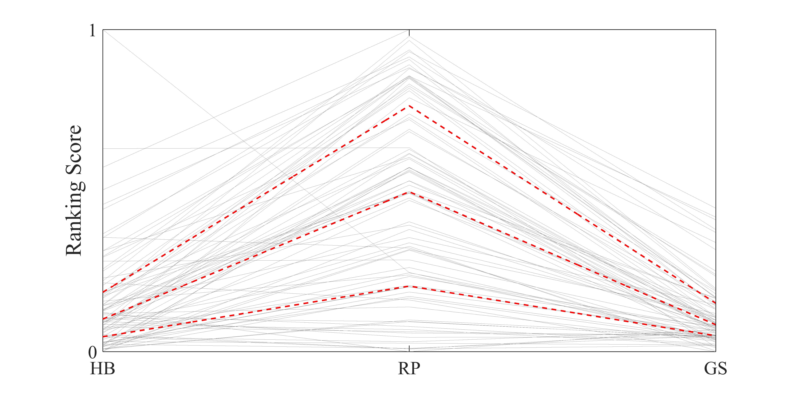

[](http://quantlet.de/index.php?p=info)

## [](http://quantlet.de/) **ARRpcpmer** [](http://quantlet.de/d3/ia)

```yaml

Name of QuantLet : ARRpcpmer

Published in : ARR - Academic Rankings Research

Description : Creates a parallel coordinates plot for the main scores of HB, RP and GS

Keywords : 'plot, correlation, correlation matrix, dependence, multivariate, multivariate analysis,
visualization, data visualization, analysis, discriptive methods, discriptive, graphical
representation, descriptive-statistics, parallel coordinates plots, quantile'

See also : 'ARRboxage, ARRboxgscit, ARRboxhb, ARRcormer, ARRdenmer2d, ARRdenmer3d, ARRhexage,
ARRhexcit, ARRhexhin, ARRhismer, ARRmosage, ARRmosagegr, ARRmossub, ARRpcpgscit, ARRpcphb,
ARRpcprp, ARRqrqqhb, ARRscaage, ARRscamer'

Author : Alona Zharova

Submitted : Sat, April 30 2016 by Alona Zharova, Marius Sterling

Datafile : 'ARRdata.dat - The data set contains different researcher (3218 rows) of either RePEc
(77 columns), Handelsblatt (48 columns) ranking or both and their Google Scholar data (16 columns)
as well as age and subject fields (2 columns)'

Output : 'Parallel coordinate plot for three variables (HB, RP and GS) on 84 researchers for
December 2015. RP values are rescaled. Red lines denote the three quartiles (25%, 50% and 75%)'

```




### MATLAB Code:
```matlab
%% Clearing all variables
clear all; clc;
%% Figure settings
fonttype           = 'Times New Roman';
fontsize           = 24;
fontsize_axes      = 20;
fontsize_axes_top  = 16;
papersize          = [30 15];
quantile_linewidth = 1.4;
%% Data input
merge        = readtable('ARRdata.dat','Delimiter',';');
%% Data selection
substrmatch  = @(x,y) ~cellfun(@isempty,strfind(y,x));
findmatching = @(x,y) y(substrmatch(x,y));
x1           = substrmatch('hb_commonscore',merge.Properties.VariableNames);
x2           = substrmatch('rp_average_rank_score',merge.Properties.VariableNames);
x3           = substrmatch('gs_total_cites',merge.Properties.VariableNames);
x            = x1|x2|x3; % selecting researchers who have scores in all 3 ranking scores
TF           = ismissing(merge(:,x));
z1           = table2array(merge(~any(TF,2),{'hb_commonscore','rp_average_rank_score','gs_total_cites'}));
%% Reversing the scala of RP, since best score is lowest (HB and GS are vice versa)
z1(:,2) = -z1(:,2);
%% Standardizing of values
y       = (z1-(ones(size(z1,1),1)*min(z1)))./(ones(size(z1,1),1)*(max(z1)-min(z1)+(max(z1)==min(z1))));
label   = {'HB','RP','GS'};
%% Creating figure
figure1 = figure('Visible','on','PaperPosition',[0 0 papersize],'PaperSize',papersize);
a=125;
parallelcoords(y,'linewidth',0.01,'label', label,'Color',[a/255 a/255 a/255])
    set(gca,'FontSize',fontsize_axes,'FontName',fonttype,'YTickLabel',{'0','1'},'YTick',[0 1]);
    ylabel('Ranking Score','FontSize',fontsize,'FontName',fonttype);
    box on;
    % computing and ploting of quartiles 
    y2=quantile(y,[0.25 0.5 0.75]);
    line(1:length(label),transpose(y2),'linewidth',quantile_linewidth,'Color','r','LineStyle','--');
    box on;
    % creating a second x-axes on top of the plot where the maximum values are noted
    ax1 = gca;
    ax2 = axes('Position',ax1.Position,...
        'FontSize',fontsize_axes_top,...
        'FontName',fonttype,...
        'XAxisLocation','top',...
        'YAxisLocation','right',...
        'XTick',(ax1.XTick-1)/(length(ax1.XTick)-1),...
        'XTickLabel','',...
        'YTick',[],...
        'YTickLabel','',...
        'Color','none');
%% Saving figure
print(figure1,'-dpng','-r400','ARRpcpmer');
```
